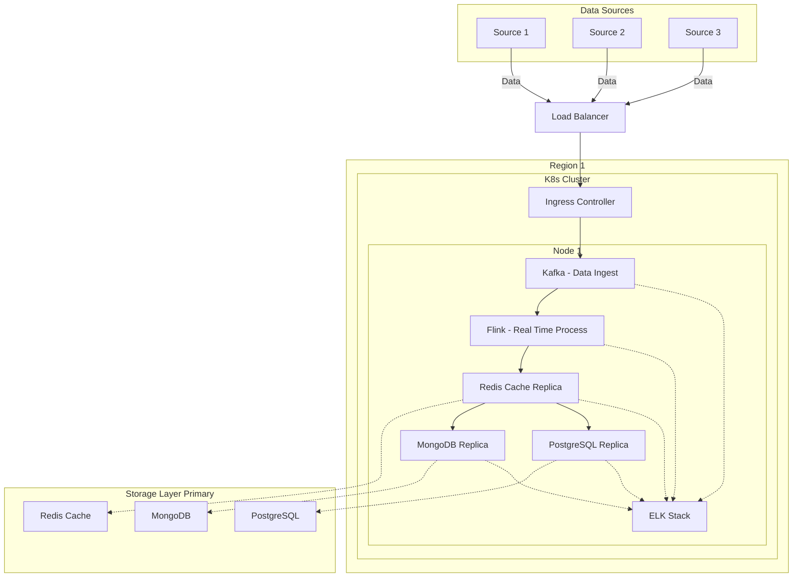

# resume
static site for resume

```mermaid
    graph TB
        subgraph "Data Sources"
            DS1[Source 1]
            DS2[Source 2]
            DS3[Source 3]
        end
        
        LB[Load Balancer]

        subgraph R1[Region 1]
            subgraph KC1[K8s Cluster]
                ING1[Ingress Controller]
                subgraph KCN11[Node 1]
                    K1[Kafka - Data Ingest]
                    F1[Flink - Real Time Process]
                    RR11[Redis Cache Replica]
                    RMDB11[MongoDB Replica]
                    RPG11[PostgreSQL Replica]
                    ELK1[ELK Stack]
                end
            end
        end

        subgraph "Storage Layer Primary"
            R[Redis Cache]
            MDB1[MongoDB]
            PG1[PostgreSQL]
        end

        DS1 & DS2 & DS3 -->|Data| LB
        LB --> ING1
        ING1 --> K1
        RR11 -.-> R
        RMDB11 -.-> MDB1
        RPG11 -.-> PG1
        K1 --> F1
        F1 --> RR11
        RR11 --> RMDB11
        RR11 --> RPG11
        K1 -.-> ELK1
        F1 -.-> ELK1
        RR11 -.-> ELK1
        RMDB11 -.-> ELK1
        RPG11 -.-> ELK1
```