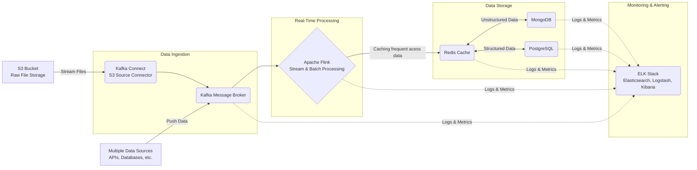
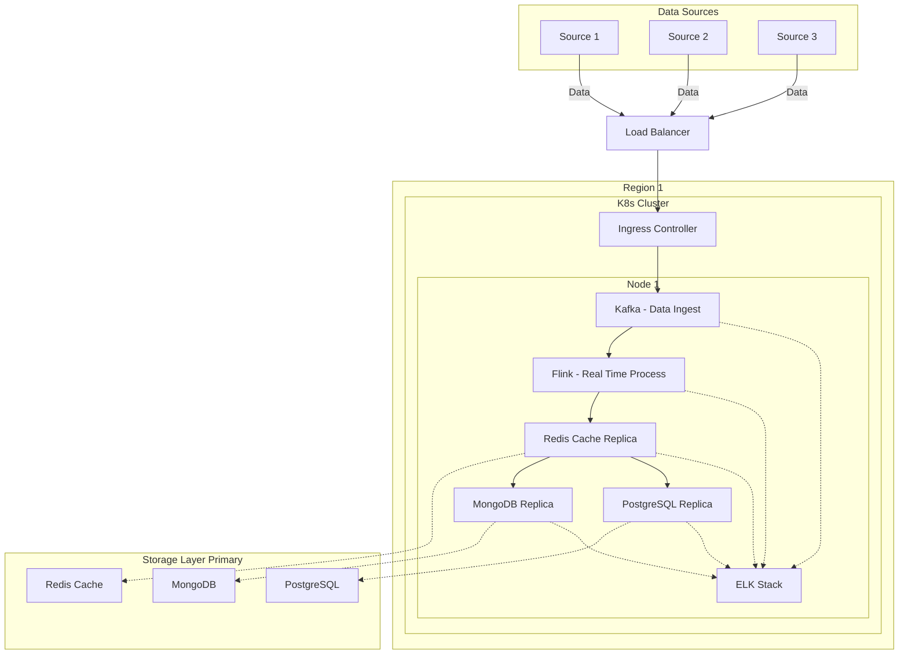

# resume
static site for resume

## How Do the Services Communicate with Each Other?
#### Note
- This can be scaled by deployment in K8s, refer to below diagram

## How Does Kubernetes Deployment for above service look like?
#### Note
- We can have multiple Regions for High Availibity
- Also we can have **multiple replicas of Pods in diffrent Worker Node**, managed by K8s
- Below digram we have **only 1 node for easy of understanding**

