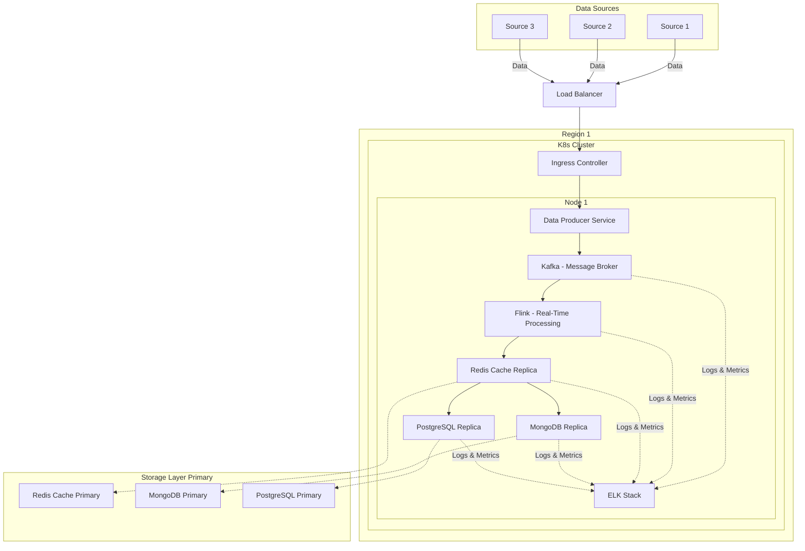

# resume
static site for resume

## How Do the Services Communicate with Each Other?
#### Note
- This can be scaled by deployment in K8s, refer to below diagram

## How Does the Kubernetes Deployment for the Above Service Look?
#### Note
- We can have multiple regions to ensure high availability.
- Kubernetes can manage **multiple replicas of pods across different worker nodes for scalability and fault tolerance**.
- For **simplicity**, the diagram below shows **only one node**.

